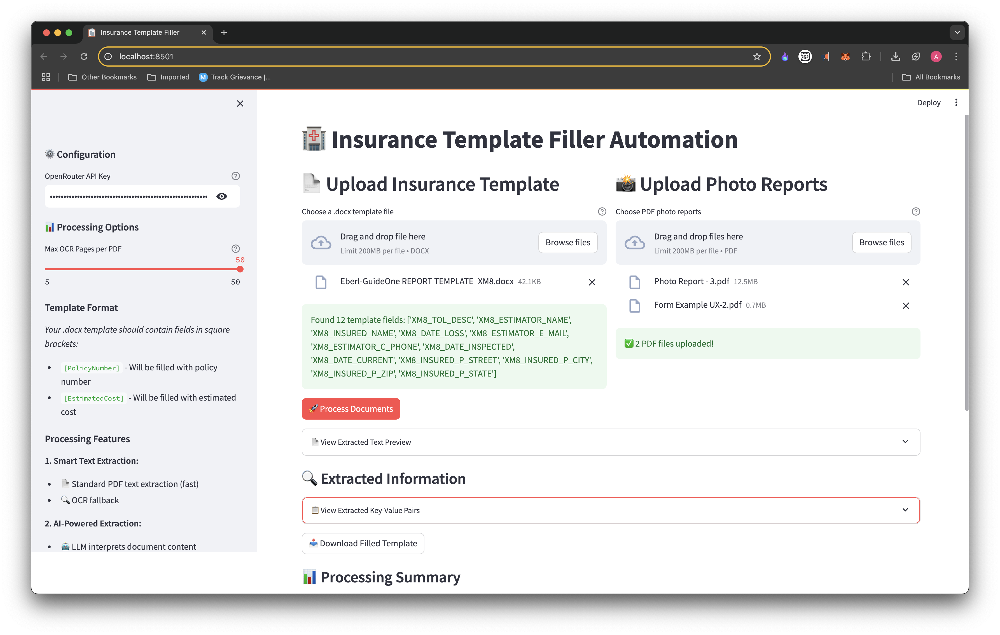

# **Image-AI-Automation**
  <div align="center">
     
  </div>
A unified Python-based toolkit that integrates Computer Vision and Natural Language Processing to automate three real-world tasks: 
- RGB-Thermal image alignment
- Visual change detection
- Document template filling using LLMs

*(These tasks were actually my assignments.)*

## **Repository Structure**
```
Image-AI-Automation/
│
├── task1/
│   ├── task1_code.py
│   ├── input-images/
│   └── output-images/
│
├── task2/
│   ├── task2_code.py
│   ├── input-images/
│   └── output-images/
│
├── task3/
│   ├── task1_code.py
│   ├── input/
│   └── output/
│
├── sample-output/
│   ├── task3_streamlit_app.png
├── task.png
│
├── requirements.txt
└── README.md
```
---

## **Tasks Overview**

### **Task 1 – RGB-Thermal Image Overlay**

- **Objective**: Align thermal images (`XXXX_T.JPG`) with RGB images (`XXXX_Z.JPG`).
- **Approach**: Homography transformation using feature matching.
- **Output**: Aligned thermal overlays.
- **Folder**: `task1_rgb_thermal_overlay/`

---

### **Task 2 – Change Detection Algorithm**

- **Objective**: Compare aligned “before” and “after” image pairs to detect visual changes.
- **Approach**: Image differencing + contour detection.
- **Output**: Bounding boxes or masks highlighting changes.
- **Folder**: `task2_change_detection/`

---

### **Task 3 – GLR Pipeline with Streamlit**
  <div align="center">  </div>
- **Objective**: Automate .docx insurance form filling based on photo reports (.pdf).
- **Tech Stack**: Streamlit + OCR + LLM (OpenRouter or DeepSeek)
- **Output**: Auto-filled insurance document.
- **Folder**: `task3_glr_streamlit_app/`

---

## **Requirements**
- Install dependencies using:

```bash
pip install -r requirements.txt
```
- Main libraries:
	•	opencv-python
	•	numpy
	•	streamlit
	•	python-docx
	•	PyMuPDF (fitz)
	•	requests (for OpenRouter API)

⸻

## **Sample Outputs**

See the sample-output/ folder for results of all three tasks.

⸻

## **LLM API Key Setup (for Task 3)**

Set your OpenRouter API key securely using .streamlit/secrets.toml:
```
[general]
OPENROUTER_API_KEY = "your-key-here"
```

⸻
Contact me: arpitpatel.it2025@gmail.com

⸻
